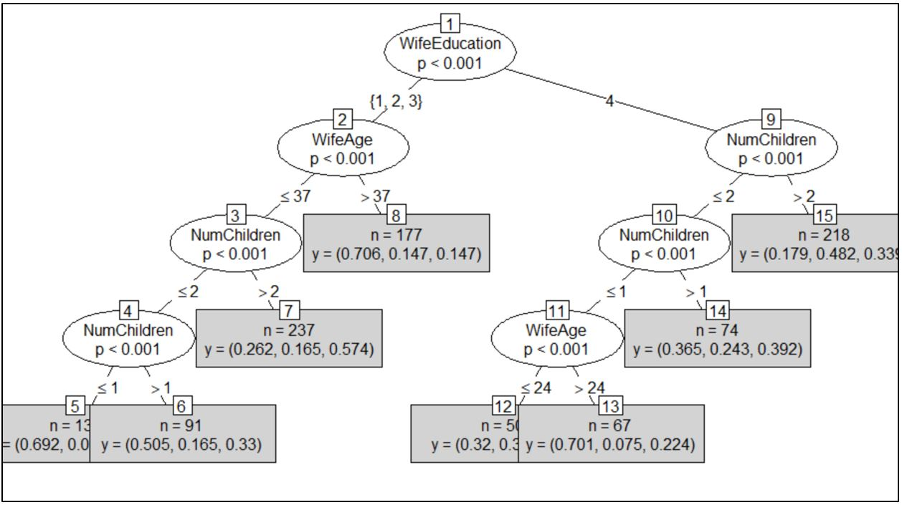
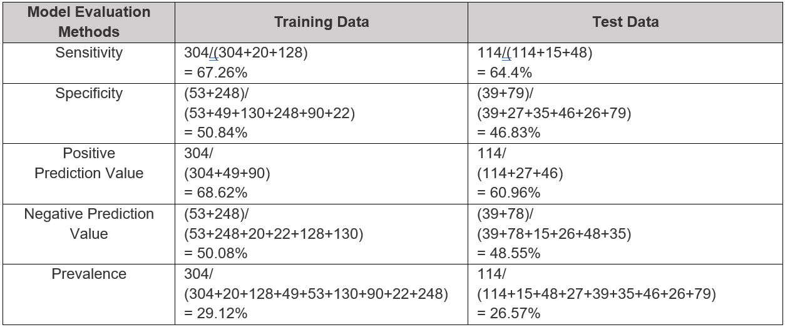

<!-- PROJECT LOGO -->

    
  </a>

  <h3 align="center">Contraception in Indonesia</h3>

  

    Predicting the contraceptive method choice from 1987 using a decision tree.
     
    <a href="https://github.com/Mathurkarishma/indonesian-contraception-in-1987"><strong>Explore the docs »</strong></a>
     
     
    <a href="https://github.com/Mathurkarishma/indonesian-contraception-in-1987/issues">Report Bug</a>
    ·
    <a href="https://github.com/Mathurkarishma/indonesian-contraception-in-1987/issues">Request Feature</a>
  

<!-- TABLE OF CONTENTS -->

  
<h2 style="display: inline-block">Table of Contents</h2>

  <ol>
    <li>
      <a href="#about-the-project">About The Project</a>
      <ul>
        <li><a href="#built-with">Built With</a></li>
      </ul>
    </li>
    <li>
      <a href="#getting-started">Getting Started</a>
    </li>
    <li><a href="#usage">Usage</a></li>
    <li><a href="#conclusion">Conclusion</a></li>
    <li><a href="#contact">Contact</a></li>
    <li><a href="#acknowledgements">Acknowledgements</a></li>
  </ol>

<!-- ABOUT THE PROJECT -->
## About The Project

We will be speaking into a survey conducted by the National Indonesia Contraceptive Prevalence in 1987.  The survery requested married women who were either not pregnant or did not know if they were at the time to participate.  We want to predict the current contraceptive method choice of a woman in this dataset based on her demographic and socio-economic characteristics.  The choices are either no use, long-term methods, or short-term methods.  We will be using a decision tree model, which predict outcomes through classification rules.  It distills data into knowledge by taking a set of unfamiliar data and extracting rules. 

Here is a [link](https://archive.ics.uci.edu/ml/datasets/Contraceptive%20Method%20Choice) to the Contraceptive Method Choice dataset information.

### Built With

* [R](https://cran.r-project.org/)
* [RStudio](https://rstudio.com/)

<!-- GETTING STARTED -->
## Getting Started

To get a local copy up and running, download the `decision-tree-model.R` and the text input file, `cmc.csv`. Then run the code in an IDE software, such as RStudio.  Set the working directory to the location of the CSV file.

<!-- USAGE EXAMPLES -->
## Usage

The code guides you through the following:

1. Importing the CSV file
2. Visualizing the formatting of the variables (datatypes, number of rows/columns, measures of central tendancy, statistical descriptions, etc.)
3. Exploring through histograms to find interesting variables
4. Pre-processing such as transformation and installing decision tree packages (we removed factored categorical variables)
5. Set the seed to allow for reproducability and split the dataset into a training set and test set
5. Perform the decision tree model and evaluate the confusion matrix
6. Change parameters to improve accuracy
7. Compare model evaluation methods such as sensitivity, specificity, positive prediction value, negative prediction value, and prevalence of the data

<!-- CONCLUSION -->
## Conclusion

The code results in the below decision tree ultimately.  It shows 8 terminal nodes and a vector representing the proportion of instances in the node that have each of the three class values.  For example, terminal node 6 states that 91 instances apply to this exact classification.  50.5% married woman out of the 91 do not use contraception, 16.5% use long-term contraception, and 3.3% use short-term contraception.

Furthermore, the below table calculates each of the model evaluation methods based off the training data confusion matrix and the test data confusion matrix.  The true positive will be used as the number of couples who are not using contraception and the true negative will be used as the number of those using both long-term and short-term contraception.  Every percentage of each of the evaluation methods in the table show a decrease between the training data and test data.  If the model starts off overfitting on the training data, it will not generalize well for new unseen data, like the test data.  Every dataset going forth that uses this model will have a similar outcome – low classification accuracy and other low evaluation metrics.	

Education, being of the highest significance and our first assumption for the likelihood of contraception use, may have played a part in the level of accuracy of the model.  However, due to the model being extremely overfit, proper outcomes were difficult to come by.  Additionally, it was interesting to start off with the fact that the survey gave no option for a husband to not be holding an occupation.  For instance, if the wife was working a job, then we do not know if the husband also was working or was not.  This is a factor that we were not able to consider due to the lack of data in the dataset.

<!-- CONTACT -->
## Contact

Karishma Mathur - karishma324@gmail.com

Project Link: [https://github.com/Mathurkarishma/indonesian-contraception-in-1987](https://github.com/Mathurkarishma/indonesian-contraception-in-1987)

<!-- ACKNOWLEDGEMENTS -->
## Acknowledgements

* Dr. Firdu Bati at [University of Maryland, Global Campus](https://www.umgc.edu/) - Fall 2019  
* [Contraceptive Method Choice Dataset Description](https://archive.ics.uci.edu/ml/datasets/Contraceptive%20Method%20Choice)
